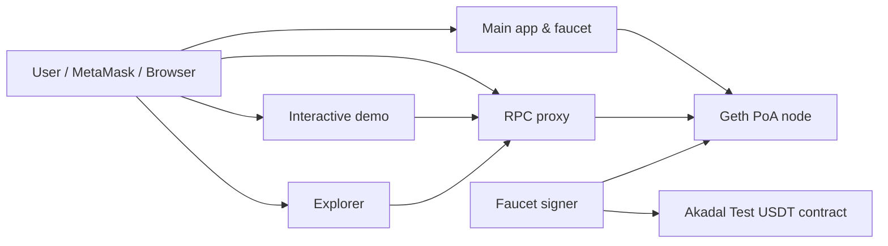

# Akadal Chain

[](https://blockchain.akadal.tr)
[](https://rpc.blockchain.akadal.tr)
[](https://github.com/akadal/blockchain)
[](./docker-compose.yml)

Akadal Chain is a Docker-first, Ethereum-compatible educational blockchain network.
It gives students and developers a safe place to learn Web3 fundamentals, connect MetaMask,
request test funds, deploy Solidity contracts, inspect transactions, and experiment with
DeFi, NFT, DAO, and token mechanics without using real money.

The public instance is live at [blockchain.akadal.tr](https://blockchain.akadal.tr).
Use it directly, or fork this repository and run your own version.

> Akadal Chain is for education and experimentation. The ETH and USDT on this network have no monetary value.
> The included genesis private key is intentionally public and must never be reused for real funds.

## Live Network

| Surface | URL | Purpose |
| --- | --- | --- |
| Main app & faucet | [blockchain.akadal.tr](https://blockchain.akadal.tr) | Landing page, MetaMask setup, ETH/USDT faucet, recent blocks |
| Interactive demo | [demo.blockchain.akadal.tr](https://demo.blockchain.akadal.tr) | Browser-based blockchain, cryptography, Web3, DeFi, NFT, and DAO lessons |
| RPC endpoint | [rpc.blockchain.akadal.tr](https://rpc.blockchain.akadal.tr) | Public JSON-RPC endpoint for wallets and apps |
| Explorer | [explorer.blockchain.akadal.tr](https://explorer.blockchain.akadal.tr) | Blocks, transactions, addresses, and contract activity |
| Repository | [github.com/akadal/blockchain](https://github.com/akadal/blockchain) | Source code and deployment files |

### MetaMask Settings

| Field | Value |
| --- | --- |
| Network name | `Akadal Chain` |
| RPC URL | `https://rpc.blockchain.akadal.tr` |
| Chain ID | `1337` |
| Currency symbol | `ETH` |
| Block explorer URL | `https://explorer.blockchain.akadal.tr` |

After adding the network, open [blockchain.akadal.tr](https://blockchain.akadal.tr)
to request `1 ETH` or `1000 USDT` from the faucet.

## What Is Included

- **Ethereum-compatible PoA chain:** a lightweight Geth `v1.13.15` network using Clique consensus.
- **MetaMask-ready RPC:** an Nginx proxy handles browser CORS and forwards traffic to Geth.
- **Public faucet:** sends test ETH and mints Akadal Test USDT from a persisted contract.
- **Block explorer:** Alethio Lite Explorer connected to the public RPC endpoint.
- **Interactive demo:** a separate browser lab for hashing, encryption, signatures, wallets, blocks, transactions, smart contracts, tokenomics, NFT/RWA, DeFi, and DAO flows.
- **Coolify-friendly deployment:** the stack is designed to run as a single Docker Compose service on a small VPS.

## Architecture



| Service | Internal port | Default public role |
| --- | ---: | --- |
| `geth` | `8545`, `8546` | Ethereum JSON-RPC and WebSocket node |
| `rpc-proxy` | `80` | Public RPC endpoint with CORS handling |
| `explorer` | `80` | Browser explorer UI |
| `faucet` | `3000` | Main app, ETH faucet, USDT faucet, token metadata API |
| `demo` | `3000` | Interactive learning lab |

## Network Details

| Setting | Value |
| --- | --- |
| Chain ID | `1337` |
| Consensus | Proof of Authority, Clique |
| Block period | `15s` |
| Gas limit | `800000000` |
| Native currency | `ETH` |
| Geth version | `ethereum/client-go:v1.13.15` |
| Faucet ETH amount | `1 ETH` per request |
| Faucet USDT amount | `1000 USDT` per request |
| Master account | `0xf39Fd6e51aad88F6F4ce6aB8827279cffFb92266` |

Geth `v1.13.15` is used deliberately because it keeps a simple PoA development
chain practical without requiring Beacon Chain or post-Merge validator infrastructure.

## Run Locally

### Prerequisites

- Docker and Docker Compose
- Node.js `18+` if you want to run the test scripts locally

### Start the stack

```bash
git clone https://github.com/akadal/blockchain.git
cd blockchain
docker compose up --build -d
```

Local endpoints:

| Service | URL |
| --- | --- |
| Faucet / main app | `http://localhost:3000` |
| Direct local RPC | `http://localhost:8545` |
| Explorer UI | `http://localhost:4000` |
| Interactive demo | `http://localhost:5454` |

Useful commands:

```bash
docker compose ps
docker compose logs -f geth faucet rpc-proxy
docker compose down
```

The local explorer image is configured for the public RPC by default. If you want
the local explorer to inspect your local chain, override `APP_NODE_URL` for the
`explorer` service or edit it in `docker-compose.yml`.

## Deploy Your Own Fork

1. Fork [akadal/blockchain](https://github.com/akadal/blockchain).
2. Create a Docker Compose service in Coolify or your preferred Docker host.
3. Point each domain to the matching service and internal port.
4. Replace the public Akadal URLs with your own domain values.
5. Deploy and keep the Docker volumes if you want the chain and USDT contract to persist.

Recommended domain mapping:

| Domain | Service | Internal port |
| --- | --- | ---: |
| `https://blockchain.yourdomain.com` | `faucet` | `3000` |
| `https://rpc.blockchain.yourdomain.com` | `rpc-proxy` | `80` |
| `https://explorer.blockchain.yourdomain.com` | `explorer` | `80` |
| `https://demo.blockchain.yourdomain.com` | `demo` | `3000` |

Values to update when forking:

| Location | What to change |
| --- | --- |
| `docker-compose.yml` | `APP_NODE_URL`, `EXPLORER_URL`, `RPC_URL`, `DEMO_URL`, `MAIN_URL` defaults |
| `faucet/public/index.html` | Public RPC, explorer, demo, repository, and visible network URLs |
| `demo/entrypoint.sh` | Default fallback URLs for the demo container |
| `genesis.json` / `geth-config/genesis.json` | Chain ID, signer, balances, and Clique signer data if you want a separate network identity |

If you change the genesis file after a chain has already started, existing Geth
data may keep the old chain state. Start from a fresh volume only when you
intentionally want a new chain.

## Faucet API

The faucet is served by the `faucet` service.

```http
GET /health
GET /token/usdt
POST /fund
POST /fund-usdt
```

Example ETH faucet request:

```bash
curl -X POST http://localhost:3000/fund \
  -H "Content-Type: application/json" \
  -d '{"address":"0x0000000000000000000000000000000000000000","amount":"1"}'
```

Example USDT metadata request:

```bash
curl http://localhost:3000/token/usdt
```

The USDT contract address is stored in the persistent `faucet_data` volume at
`/app/data/usdt-token.json`. If the saved contract is valid, the faucet reuses it
after redeployments. If it is missing or invalid, the faucet deploys a new
`AkadalUSDT` contract.

## Development

Install JavaScript dependencies:

```bash
npm install
```

Run unit checks:

```bash
node tests/unit_test.js
```

Run integration checks against a running stack:

```bash
node tests/integration_test.js
```

Override integration targets when needed:

```bash
RPC_URL=https://rpc.blockchain.akadal.tr \
FAUCET_URL=https://blockchain.akadal.tr \
EXPLORER_URL=https://explorer.blockchain.akadal.tr \
node tests/integration_test.js
```

## Project Structure

```text
.
|-- docker-compose.yml          # Main service orchestration
|-- geth-config/                # Geth image, genesis, boot script, signer password
|-- nginx/                      # RPC proxy image and CORS-aware Nginx config
|-- faucet/                     # Main app, faucet API, AkadalUSDT contract artifact
|-- demo/                       # Interactive browser learning lab
|-- tests/                      # Unit and integration test scripts
|-- genesis.json                # Root copy of the chain genesis
`-- GEMINI.md                   # Maintainer/AI project context
```

## Security Notes

- This is an educational chain, not a production financial network.
- The bundled private key is public and intentionally pre-funded in genesis.
- Do not send mainnet ETH, real tokens, or private production keys to this network.
- The RPC surface exposes development-friendly methods such as `debug`, `txpool`, and `miner`.
- Add authentication, rate limiting, monitoring, and a private signer strategy before adapting this pattern to a real environment.

## Troubleshooting

### MetaMask cannot fetch the chain ID

Use the RPC proxy URL, not the raw Geth container:

```text
https://rpc.blockchain.akadal.tr
```

For your own deployment, make sure the `rpc-proxy` service is exposed publicly and
that Coolify maps the domain to internal port `80`.

### Faucet is not ready

Check whether Geth is reachable and whether the faucet signer is connected:

```bash
docker compose logs -f geth faucet
curl http://localhost:3000/health
```

### USDT address changed after deployment

The faucet persists the token address in the `faucet_data` volume. If that volume
is deleted, the faucet deploys a new Akadal Test USDT contract.

### Explorer opens but shows no data

The explorer runs in the user's browser, so its `APP_NODE_URL` must point to a
publicly reachable RPC URL, not an internal Docker hostname.

## Contributing

Contributions are welcome:

1. Fork the repository.
2. Create a focused branch.
3. Keep changes small and explain the educational use case.
4. Run the relevant unit or integration checks.
5. Open a pull request with screenshots for UI changes.

If you change service topology, network parameters, deployment behavior, or core
configuration, update both `README.md` and `GEMINI.md` so future maintainers have
the same mental model.

## License

This repository is public, but no `LICENSE` file is currently included. Before
promoting it as a reusable open source package, choose and add an explicit license
such as MIT or Apache-2.0.
